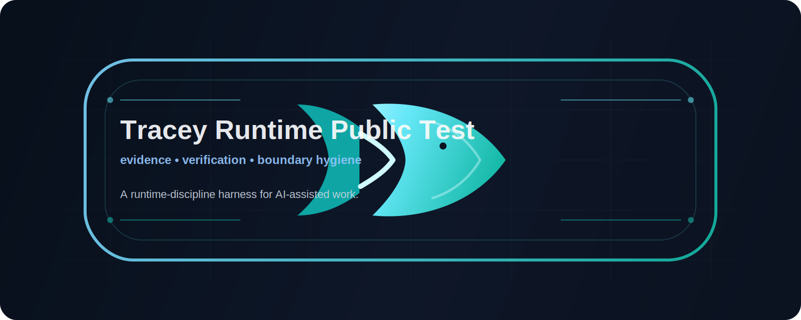

<p align="center">
  
</p>


# Tracey Runtime Public Test

> A runtime-discipline harness for evidence, verification, and boundary hygiene in AI-assisted work.

This repo is a **small, public-facing slice** extracted from a larger Tracey workspace.
It exists so other people can:
- read the architecture ideas without private context
- run the tests locally
- open a static audit viewer
- report confusion, bugs, or boundary mismatches

## What this repo is
- a portable runtime-discipline demo
- a bundle of contracts, pure helpers, monitor logic, and tests
- a static viewer for task-run audit records
- a feedback surface for public review

## What this repo is not
- not production runtime
- not canonical memory
- not a full autonomous agent
- not the full private Tracey workspace
- not proof of continuity by itself

## How this differs from prompt/skill frameworks

Tracey is not a motivational skill and does not rely on the agent "feeling encouraged" to behave better.

Prompt/skill frameworks can improve agent posture.
Tracey focuses on runtime discipline:

- evidence is recorded before authority is granted
- completion claims require verification
- UI surfaces are viewer-only unless actor authority is explicitly designed
- failure handling is expressed as protocol, not emotional pressure
- governance records decisions but does not silently self-tune

In short:
**skills change how an agent tries;**
**Tracey changes what the system is allowed to accept as done.**

## Why this exists

This repo exists to answer four practical questions:

| Question | What we want to know |
| --- | --- |
| Is it clear? | Can a stranger understand the repo in a few minutes? |
| Is it reproducible? | Can they clone it and run the tests without special setup? |
| Is it auditable? | Can they open the viewer and inspect the runtime flow? |
| Is it feedback-ready? | Can they file actionable issues instead of vague impressions? |

## Quickstart
```bash
git clone https://github.com/tamvi-journal/tracey-runtime-public-test.git
cd tracey-runtime-public-test
python3 runtime/run_tests.py
python3 runtime/operator_ux/generate_task_index.py
```

Then open one of these static files in a browser:
- `runtime/operator_ux/home.html`
- `runtime/operator_ux/task_run_index.html`
- `runtime/operator_ux/status_legend.html`

## Core ideas
- **monitor before commit**
- **evidence is not authority**
- **verification before completion claims**
- **viewer-only audit surfaces should not gain actor powers**

## At a glance

| Layer | Purpose |
| --- | --- |
| `runtime/contracts/` | Shared literals, types, and schemas for the public slice |
| `runtime/core/` | Pure helpers for gate, monitor, verification, bridge, and evidence handling |
| `runtime/monitor/` | Deterministic monitor-stage logic |
| `runtime/tests/` | Boundary-oriented regression checks |
| `runtime/operator_ux/` | Static viewer pages and generated audit index |
| `runtime/task_runs/` | Sample task-run records for demo and review |
| `runtime/templates/` | Reusable protocol record templates |

## Happy path
1. Run the tests.
2. Regenerate the task index.
3. Open the static viewer pages.
4. Inspect whether the repo keeps evidence, verification, and authority boundaries aligned.

## What kind of feedback is most useful
Please focus on:
- boundary mismatch between docs and code
- places where evidence accidentally becomes authority
- places where completion can be claimed without verification
- viewer surfaces that appear to have actor power
- unclear test expectations or missing regression cases

## Read more
- `docs/architecture-overview.md`
- `docs/concepts/runtime-spine.md`
- `docs/concepts/evidence-vs-authority.md`
- `docs/concepts/verification-before-completion.md`
- `docs/concepts/monitor-before-commit.md`

## License
MIT.
